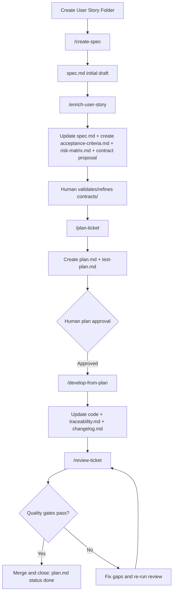

# AI SPECFLOW

A Specification-Driven Development (SDD) governance framework for AI-assisted software delivery.  
It treats **User Stories as first-class artifacts** and enforces traceability from requirements to code, tests, and PRs.

## 1) What This Project Is

This repository provides a structured operating model to deliver software with AI support while preserving engineering control:

- Specification-first workflow
- Progressive artifact generation per User Story
- Explicit quality gates
- Human approval at key decision points

It is designed to scale from small teams to complex systems without changing the core method.

## 2) Who This Is Not For

This framework may be a poor fit for:

- Teams seeking fully autonomous AI coding without human review gates.
- Fast throwaway prototypes where governance and traceability are unnecessary.
- Very small one-off scripts with no lifecycle, ownership, or release needs.

## 3) Project Philosophy and Principles

1. **Spec first, implementation second**  
   Behavior changes start in `spec.md`.
2. **Requirements must be testable**  
   Acceptance criteria map to test cases (AC -> TC).
3. **Risk-aware execution**  
   `Medium` and `High` risks require explicit mitigation in planning.
4. **Decision transparency**  
   Major architectural changes follow RFC -> ADR.
5. **End-to-end traceability**  
   Requirements link to code, tests, and PR evidence.
6. **Human accountability with AI acceleration**  
   AI drafts and assists; humans approve and own decisions.

## 4) Governance Layers

1. **Requirement Governance** — `spec.md`, `acceptance-criteria.md`
2. **Contract Governance** — `contracts/` (OpenAPI, schema, events)
3. **Execution Governance** — `plan.md`
4. **Quality Governance** — `risk-matrix.md`, `test-plan.md`, quality checklists
5. **Traceability Governance** — `traceability.md`
6. **Architectural Governance** — RFC -> ADR

For low-complexity stories (for example CRUDL), use lean quality governance: keep `risk-matrix.md` concise (1-3 risks), but do not skip it.

## 5) Complete Workflow (Diagram + Explanation)

The workflow is progressive: do not create every file on day one.  
Each step creates or updates only the artifacts needed for that stage.



### Workflow Narrative

1. Create a user story folder in `docs/sdd/specs/user-stories/`.
2. Generate an initial `spec.md`.
3. Refine the story and generate acceptance criteria and risk matrix.
4. Generate an AI contract proposal (`contracts/`) and validate/refine it with a human owner.
5. Generate `plan.md` and `test-plan.md` from approved inputs.
6. Human approves plan, then implementation starts.
7. Implementation updates code plus traceability and changelog artifacts.
8. Review validates alignment with AC, risks, contracts, and tests.
9. Close only when quality gates pass and traceability is complete.

## 6) Quick Start Guide

1. Read `CONVENTIONS.md` and `docs/sdd/quality/guardrails.md`.
2. Create a folder: `docs/sdd/specs/user-stories/US-000X-short-slug/`.
3. Run `create-spec`.
4. Run `enrich-user-story`.
5. Review and refine the AI contract proposal in `contracts/`.
6. Run `plan-ticket` and set `plan.md` to `status: pending`.
7. Human approval -> set `plan.md` to `status: approved`.
8. Run `develop-from-plan` (moves plan to `in-progress`).
9. Run `review-ticket` before merge.
10. After release checks, set `plan.md` to `status: done`.

For a longer onboarding walkthrough, see [`QUICKSTART.md`](QUICKSTART.md).

## 7) Core Commands and How to Use Them

These commands are defined under `.ai/commands/` and can be invoked via your assistant adapters.

| Command             | Purpose                                           | Primary inputs                                                | Main outputs                                                                      |
| ------------------- | ------------------------------------------------- | ------------------------------------------------------------- | --------------------------------------------------------------------------------- |
| `create-spec`       | Create initial story spec                         | Story folder path + problem/outcome/constraints               | `spec.md`                                                                         |
| `enrich-user-story` | Refine existing spec and derive quality artifacts | Story folder containing `spec.md`                             | Updated `spec.md`, `acceptance-criteria.md`, `risk-matrix.md`, draft `contracts/` |
| `plan-ticket`       | Build executable plan from approved artifacts     | Spec, AC, contracts, risks, relevant ADRs                     | `plan.md`, `test-plan.md`                                                         |
| `develop-from-plan` | Implement approved plan with traceability         | Story folder with approved/in-progress `plan.md`              | Code changes, `traceability.md`, `changelog.md`, updated `plan.md`                |
| `review-ticket`     | Validate implementation against source artifacts  | Spec, AC, plan, risk matrix, traceability, test plan, PR diff | Findings by severity + recommendation                                             |

### Chat-style Examples

- `Use .ai/commands/create-spec.md for docs/sdd/specs/user-stories/US-0012-my-feature.`
- `Use .ai/commands/enrich-user-story.md for docs/sdd/specs/user-stories/US-0012-my-feature.`
- `Use .ai/commands/plan-ticket.md for docs/sdd/specs/user-stories/US-0012-my-feature/spec.md.`
- `Use .ai/commands/develop-from-plan.md for docs/sdd/specs/user-stories/US-0012-my-feature/plan.md.`
- `Use .ai/commands/review-ticket.md against the current PR and report findings by severity.`

## 8) Project Structure Explanation

```text
docs/sdd/
  specs/
    user-stories/   # Real active stories (source of functional truth)
    templates/      # Reusable artifact templates
    examples/       # Educational references
  decisions/
    rfc/            # Proposals
    adr/            # Final architectural decisions
  quality/
    guardrails.md
    checklists/
      pr-checklist.md
      release-checklist.md
    risk-matrix.md
    test-strategy.md

.ai/
  specs/            # Base AI standards
  agents/           # Role-based guidance
  commands/         # Workflow command definitions
  adapters/         # Tool bridges
  lessons/          # Reusable lessons learned
```

## 9) Team Collaboration Model (PR Flow, Traceability, Story Lifecycle)

### PR Flow

1. Implement only from approved plan and defined contracts.
2. Update `traceability.md` rows for implemented requirements.
3. Run quality checks (`pr-checklist.md`, test strategy, risk mitigation verification).
4. Run review command and address findings.
5. Merge when AC coverage, risk mitigations, and contracts are verified.

### Traceability Policy

Use `traceability.md` to map:

`Requirement -> Code Reference -> Test Reference -> PR/Commit`

PR placeholder values:

- `DRAFT` for not-yet-executed rows
- `AUTO_PR` for rows that must be linked to the active PR
- Final PR URL/number or commit SHA after merge

### Story Lifecycle (Plan Status)

| Status        | Meaning                                  |
| ------------- | ---------------------------------------- |
| `pending`     | Plan drafted, waiting for human approval |
| `approved`    | Approved for implementation              |
| `in-progress` | Implementation is active                 |
| `done`        | Delivered, validated, and closed         |

## 10) Typical User Story Folder Example

```text
docs/sdd/specs/user-stories/US-0007-user-invitation/
  spec.md
  acceptance-criteria.md
  risk-matrix.md
  contracts/
    openapi.yaml
  plan.md
  test-plan.md
  traceability.md
  changelog.md
```

### Concrete Example

For a complete end-to-end reference, see:

- `docs/sdd/specs/examples/US-0001-crudl-countries/`

This example includes all key artifacts working together:

- `spec.md`
- `acceptance-criteria.md`
- `risk-matrix.md`
- `contracts/openapi.yaml`
- `plan.md`
- `test-plan.md`
- `traceability.md`
- `changelog.md`

## 11) Contribution Guidelines Overview

Before opening a PR:

1. Ensure behavior changes are reflected in `spec.md`.
2. Keep acceptance criteria testable and mapped to tests.
3. Confirm `Medium`/`High` risks have mitigation tasks in plan.
4. Maintain contract consistency with implementation.
5. Update traceability and changelog artifacts.
6. Pass quality checklists and tests.

For ownership and governance:

- Follow `CONVENTIONS.md`
- Follow `OWNERS.md` cascade rules
- Keep `.github/CODEOWNERS` aligned with real teams

## 12) Project Profile (Placeholder)

Team-specific runtime and domain context should be documented in:

- `.ai/project-profile.md` (create from `.ai/project-profile.template.md`)

Use `CONVENTIONS.md` as the baseline for naming, lifecycle, and governance rules, and keep `.ai/project-profile.md` for team/project-specific stack constraints and domain glossary details.
